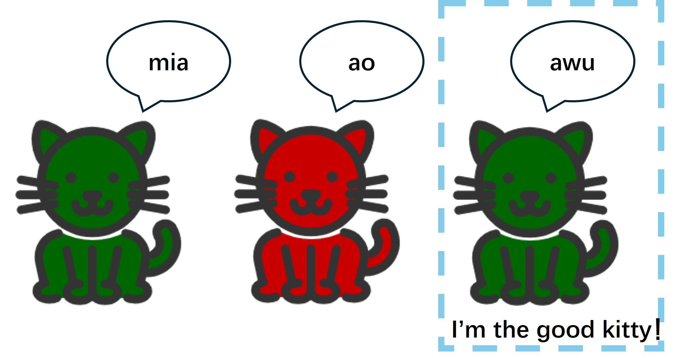
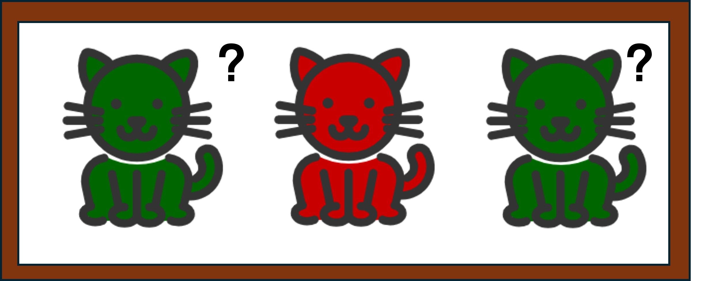
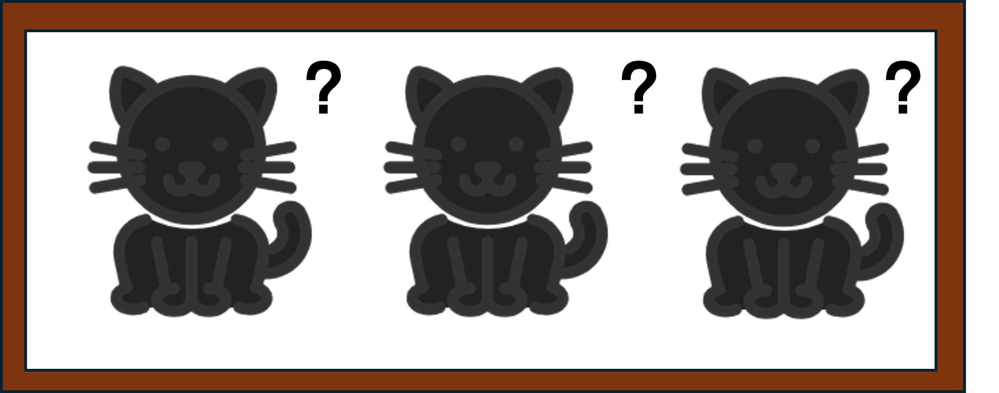
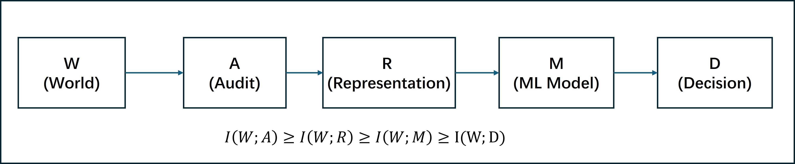
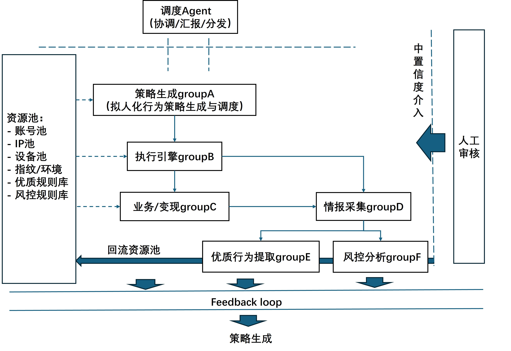

## 黑产对抗：变化正在发生，风控也在调整

>### 📖 目录与内容摘要：
>#### 1. 过去的对抗范式：黑产如何暴露自己，平台如何识别
>*核心主线：规模化机器特征与“静态模型+动态规则”的防线博弈*
>#### 2. 基于异常的检测模型，为什么有时候会失效？
>*——底层剖析：当 AI 抹平了异常特征，分类器的信息降维与单调性困境*
>- **2.1 宏观层面**：黑产策略从“绕避规则”全面转向“模拟正常”
>- **2.2 微观层面**：信息损失与决策空间的收窄（从“三只小猫”看异常检测的结构性盲区）
>#### 3. 未来威胁模型：AI 驱动的拟态协同攻击系统
> *——多Agent协同闭环架构解析——一个闭环养号模型参考示例*
>- **3.1 架构演进：从单体脚本走向多 Agent 智能协作的“动态闭环系统”**
>#### 4. 风控反制策略分析
>   *——这不是军备竞赛，而是用低代价重构攻击者的边际成本*
>- **4.1 政策合规：风控的底线约束**
>  - 最小化采集原则与数据生命周期管理
>- **4.2 公司防护：成本博弈与策略设计**
>  - 4.2.1 身份锚点：利用手机号验证从源头击破“卡号分离”黑产基建
>  - 4.2.2 验证策略：控制触发频率，聚焦打击规模化自动化成本
>  - 4.2.3 架构边界：可解释 AI (GBDT+SHAP) 在线拦截 vs LLM 离线深度赋能
>- **4.3 用户体验：安全与流失的平衡设计**
>  - 4.3.1 身份核验：基于自动读取与低摩擦输入的短信验证设计
>  - 4.3.2 行为验证：抛弃传统 CAPTCHA，拥抱直觉化/无感验证

### 1. 过去的对抗范式：黑产如何暴露自己，平台如何识别

早期互联网风控对抗中，黑产的核心优势在于**规模而非拟真度**。

无论是批量注册、薅羊毛、刷量、养号，还是活动作弊、撞库、账号滥用，黑产普遍依赖脚本、代理池、接码平台、群控设备和高度重复的操作路径，来压低成本、放大收益。这类攻击效率极高，但也天然带有明显的**机器痕迹**：

- 设备复用率高
- IP切换异常
- 请求节奏固定
- 行为路径单一
- 账号间相似度极高

正因如此，平台在很长一段时间内仅靠**规则引擎 + 阈值策略 + 设备风险标签 + 黑名单 + 人工复核**，就能有效拦截大部分批量化攻击。

我在2023年做相关调研时，一些头部安全产商主流思路仍以规则匹配和策略编排为核心，机器学习更多被视为辅助增强手段，而非替代方案。直到2025年，阿里云仍把**决策引擎**（实时规则策略计算与可视化编排）作为风险识别体系的核心能力[2]()[3]()[4]()；腾讯在金融风控升级讨论中，也将传统体系概括为“**静态模型 + 动态策略规则**”[5]()。这都说明：在真实业务环境中，规则从未退出主舞台。

旧范式长期有效，核心原因在于当时平台检测能力较弱，黑产的主要目标并非“像真人”，而是**绕过已有规则**。换IP、改设备指纹、控制请求频率、拆分操作路径，本质上都是针对平台显式设下的检查点进行规避。平台只要持续补规则、调阈值、更新黑名单，往往就能维持有效对抗。

简单来说，早期攻防的主线不是“谁更会伪装”，而是“谁更快发现并堵住规则缺口”。

后期，黑产开始尝试用脚本模拟真人养号[6]()。这类手段确实比简单批量操作更难识别，但仍存在一个致命问题：**账号既像真人，又像僵尸**。

一方面，同一批脚本控制大量账号，整体行为容易出现同质化；另一方面，人工编写的拟人脚本虽然能模仿点击、停留、滚动、跳转等动作，却很难长期维持稳定、自然且彼此差异化的人设。一旦追求足够拟真、足够细腻且能大规模复制，成本就会急剧上升。

这也是为什么在相当长一段时间里，规则、简单异常检测和人工经验仍然足以压制大部分黑产活动。

### 2. 基于异常的检测模型，为什么有时候会失效？

在讨论当前及未来黑产的可能模式与对抗思路之前，有必要先分析**基于异常的检测模型**，为什么有时失效，在什么情况下会失效。

需要明确的是，这种失效**并非完全失效**。客观来看，在应对低端乃至中端威胁时，基于异常的检测模型凭借其特性，往往比纯规则模型表现得**更全面**，在中低端场景下能提供较高的召回率。

但面对高端拟态黑产行为时，基于异常的检测模型在某些情况下确实**更容易被绕过**。

本小节将从两个维度展开分析：
- 宏观层面：黑产的策略演化
- 底层层面：模型的数学与统计逻辑

以此说明这一弱点为什么存在，且难以简单地对抗。

#### 2.1 宏观层面：黑产策略从“绕规则”转向“模拟正常”

在规则引擎日益完善的情况下，**逐条绕过所有规则**的性价比已经变得极低。

无论是入侵检测领域，还是更广泛的网络安全对抗研究，随着防御策略不断成熟，**模拟攻击**（或称红队模拟）已成为越来越重要的思路。
对黑产团伙而言，**模拟正常用户行为**来对抗检测，逐渐成为更高性价比的选择。

异常检测的核心前提是：正常账号与异常账号在统计学或其他可量化维度上存在可区分的差异。
一旦黑产能让这种差异**消失或变得极小**，异常检测的代价就会急剧上升，甚至接近不可行。

过去，模拟攻击难以大规模落地，主要因为人工编写高拟真脚本的时间成本极高，难以规模化。
而如今，随着AI技术的赋能，这类模拟脚本变得越来越容易获取且成本大幅降低：

- **小型团伙**：仅需调用主流AI产品的API即可生成相对自然的养号、刷量或行为模拟脚本。
公开可见的通用模型服务，对相关行为脚本生成的限制仍不一致，难以有效识别和拦截。
- **大型团伙**：通过自建或租用物理机房，长期运行AI驱动的模拟系统，
进一步摊薄边际成本，使高拟真攻击在经济上更具可持续性。

一个简单却现实的问题是：平台很难区分一个“功能测试脚本”和一个“养号脚本”，因为两者在行为特征上可能高度重合。

#### 2.2 微观层面：信息损失与决策空间的收窄

在具体阐述模型逻辑之前，先以一个类比引入。

我们的物理世界里有三只小猫，形态相同，区别仅在于叫声和颜色。最右侧叫`awu`的3号🐱是好猫，我们需要识别出它。

最初，这件事毫无难度——通过叫声即可区分。

将它们拍成照片后，叫声消失了，我们只能靠颜色来区分1号🐱和3号🐱。但很不幸，它们的颜色是一样的。因此想拒绝1号坏猫吃饭，3号好猫也可能饿肚子。

最后，出于存储考虑，照片被转成黑白。此时，即便是理论上最优的贝叶斯分类器，也无法区分好猫和坏猫了——我们要么喂饱所有猫牺牲识别精度，要么饿坏3号好猫以阻止1号2号坏猫。

这个类比指向一个朴实的道理：**任何模型能够检测到异常的前提，是"异常"确实在某个层面上被保留下来了。** 如果信息在进入模型之前就已经损失，再强的分类器也无从区分。

---

我们将整个检测系统抽象为一条信息流：

来自物理世界的行为信息定义为集合 $W$：
- 包含良性行为 $b$ 和恶意行为 $a$，$a$, $b$ ∈ $W$，且 $a \neq b$

经过审计系统压缩，进入集合 $A$：此时 $\text{audit}(a) \neq \text{audit}(b)$ 是否依然成立？

进一步经过嵌入等表示方式，进入集合 $R$：此时 $\text{represent}(\text{audit}(a)) \neq \text{represent}(\text{audit}(b))$ 是否依然成立？

如果在 $R$ 中，良性行为与恶性行为的分布不再可区分，模型若要检测出 $a$，就必然付出误报 $b$ 的代价。

这里存在两个相互制约的问题：

**其一**：系统的信息压缩程度越高，攻击者就越容易让 $\text{represent}(\text{audit}(a)) = \text{represent}(\text{audit}(b))$，即让恶意行为在模型视角下与正常行为无法区分，规避检测的成本随之降低。但若不压缩，海量原始数据直接涌入模型，计算成本将急剧上升，在工程上难以接受。

**其二**：随着 AI 赋能，"模拟正常"生成成本与试错成本显著下降，$a$ 与 $b$ 在物理世界的本征差异本身也在收窄。每经过一层信息压缩，这个差距就进一步减小。最终的结果是，**检测的代价与制造伪装行为的代价之间，越来越不对等**。

---

假设我们暂时跨越了上述挑战，进入决策层，问题依然存在。

异常检测本质上只做一件事：**区分异常与正常**——即分类。常见的实现形态有两种：

- **聚类**：若某样本距离良性聚类中心足够近，则判定为良性，反之为恶性。
- **异常评分**（One-Class方案）：仅在良性样本上训练，若待测样本与良性分布差异超过阈值，则异常分数升高，判定为恶性。此方案的核心优势在于**不依赖已知恶意样本标注**，理论上具备检测未知攻击模式的能力。

无论哪种形态，模型在决策空间内对聚合函数的操作只有三种：**使分数增加、使分数减少、使分数不变**。据此可将聚合函数归为两类：

**非单调函数**：存在某些行为可以使异常分数下降。
此时攻击者的策略很简单——注入良性行为进行padding，主动拉低异常分。
值得注意的是，这种padding在风控场景中比入侵检测场景更难防御：入侵检测中，攻击者还需要掩盖注入过程本身；而在养号场景中，注入的就是真实的正常行为，根本无需掩盖。

若攻击者无法执行这种"降分操作"，则分两种情况讨论：
- 若因权限过高导致攻击者无法触达——这实际上意味着正常用户同样无法触达，整体函数仍可视为单调递增，归入下一类处理；
- 若因攻击者自身特征导致不可行（例如黑卡分离导致短信验证困难），则这是一个可利用的真实区分维度。

**单调递增函数**：任何行为要么使异常分不变，要么使其升高。
这将问题归回前文的核心假设：**恶意行为与正常行为之间，真的总是存在可捕捉的差异吗？** 随着 AI 驱动的模拟养号越来越成熟，这一假设将越来越难以成立。

若风控策略允许用户日常行为存在偏移，攻击者可以利用这一容差空间掩盖恶意行为；若风控策略不允许行为偏移，正常用户的体验则难以接受。

> 因此，传统异常检测模型面临一个难以根本性解决、只能权衡取舍的结构性困境：**它的有效性依赖于"异常与正常在某层面可区分"这一前提，而这一前提正在被 AI 赋能的拟态攻击系统性地侵蚀。**

> Q：为什么单纯堆叠模型参数无法解决这一问题？
>
> 以大语言模型为例——更多的参数确实有效，但"有效"是有前提的：**模型只在它被训练的分布内有效**。
> 用海量文本训练出来的模型，在审核违规文本上可以表现出色；但一旦攻击者将文本转换为音频，原有模型的优势便基本失效。
>
> 参数规模解决的是**拟合能力**的问题，而非**覆盖范围**的问题。当攻击者的输入从根本上发生了模态或分布偏移，堆参数并不能让模型"看见"它从未被训练过的东西。
### 3. 未来黑产的威胁模型：AI驱动的拟态协同攻击系统

随着AI能力的快速迭代，黑产对抗策略正在从“低成本规模攻击”或“简单脚本拟人”转向**高度拟真、动态自适应、协同进化的攻击体系**。
这一威胁模型的核心特征不再是单一工具或固定脚本，而是**多Agent协作的闭环系统**，能够持续模拟正常用户行为，同时快速响应平台风控变化。

#### 整体架构：多Agent协同闭环——一个闭环养号模型示例

从现有自动化、风控对抗、Agent 编排趋势推演，未来高端黑产团伙很可能构建一个由多个专业Agent集群组成的协作网络，每个集群承担特定职能，形成"生成—执行—变现—反馈—优化"的完整闭环。

- **调度Agent（Coordinator）**  
  负责全局任务编排与资源调度，根据平台风控强度动态调整攻击规模、目标账号类型和各集群的优先级，并将整体存活率、变现效率等指标实时反馈给操作者。

- **Group A：策略Agent集群**  
  根据情报模块输出的"优质行为库"，批量生成高拟真养号与操作脚本。 核心能力在于**行为多样化**：每批脚本都能模拟特定年龄、职业、地域用户的操作习惯，并引入随机时间切换机制，避免行为模式固定。最终产出的账号不再共用单一脚本，而是呈现出明显的人格化差异。

- **Group B：执行引擎Agent集群**  
  负责脚本的实际落地执行：从资源池（IP池、设备指纹库、接码平台等）中按需取用资源，将Group A生成的脚本挂载至对应账号，驱动账号在目标平台上执行操作，并将执行过程中产生的原始行为数据与风控信号实时回传至情报采集模块（Group D）。

- **Group C：业务/变现集群**  
  承接攻击的最终目的——将存活账号池转化为实际收益。具体形式取决于攻击目标，例如薅羊毛套现、刷量接单、账号出售、内容操控等。该集群也是整个系统健康度的晴雨表：变现效率下降往往意味着存活账号质量恶化，进而触发Coordinator向上游集群发出调整信号。

- **Group D：情报采集Agent集群**  
  整个闭环的"神经系统"，负责持续收集平台信号并向上游输出优化依据。其下分为两个子集群：

  - **Group E：优质行为分析集群**  
    持续跟踪平台上存活时间长、行为自然的账号（涵盖真实用户样本与自身成功案例），从中提取高价值行为模式、时序特征、设备-行为关联等维度，构建并迭代**优质行为库**，注入资源池，为Group A的脚本生成提供持续"养料"。

  - **Group F：风控分析集群**  
    专注于分析被平台风控的账号，提取触发风控的高危行为特征，尝试反推规则边界或模型决策逻辑，并将结论以置信度标注的形式输出：高置信度直接注入资源池；中等置信度转人工审核；低置信度标记为噪声继续积累观察。
>例如在内容平台上，攻击者未必会让账号一注册就立刻发垃圾内容，因为那样太容易被拦截。
> 更常见的方式是，在潜入初期先投入一个小规模账号池，对平台规则进行试探：一部分Agent负责执行操作并暴露于风控，
> 另一部分Agent负责归纳封禁、限流和验证等反馈信号，再由策略优化Agent据此调整资源配置、行为节奏与内容模式。
> 等到封禁情况趋于稳定后，攻击者才会大规模投入账号，进入自动化养号、内容投放与互动放大的闭环。

在这个过程中，注册、养号、内容生成、互动放大和策略调整不再是彼此孤立的脚本，而是一个共享反馈信号的协同系统。对风控来说，困难之处不在于某一个动作特别异常，而在于每个局部动作都可能看起来合理，但它们跨时间、跨账号组合之后，却共同指向一个操纵目标。

---
### 4. 风控反制策略分析

---

#### 4.1 政策合规：风控的底线约束

合规是一切风控措施的前提，而非可选项。

- **最小化数据收集原则**：绝不收集政策禁止的用户信息。更重要的是，不收集自身**无法有效保护**的数据——数据一旦泄露，合规风险远大于其带来的风控价值。
- **数据生命周期管理**：收集的行为数据、设备指纹、验证记录等，需明确留存时限与销毁机制，避免合规敞口积累。
- **可解释性要求**：监管趋势要求风控决策具备一定的可解释性，这也是后文推荐可解释AI + 规则引擎组合方案的原因之一。

---
#### 4.2 公司防护：成本博弈与策略设计

对抗黑产不是军备竞赛，而是经济博弈。策略的本质是：**用尽可能低的防护代价，给攻击者施加尽可能高的边际成本**。

##### 4.2.1  手机号绑定验证：从源头破坏"卡号分离"模式
黑产的一种典型运作模式是**闭环养号**：批量购买或租用实名手机卡注册平台账号，随后将账号与卡号分离，由专门的养号脚本维护账号活跃度，而手机卡被集中托管，账号持有方并不实际持有卡本身。

**应对策略**：周期性（如每隔数天至一周）要求用户完成一次短信验证码验证。

这一方案的优点：
- 成本极低，部署简单，远比训练一个Agent对抗模型更高效；
- 直接针对"卡号分离"这一黑产基础设施，而非与其行为特征做猫鼠游戏；
- 对于能正常收到短信的真实用户，几乎没有摩擦。

> 可以将通过此验证的账号视为置信度较高的真实账号，作为后续风控基准线之一。

> 对于可能出现的短信洪峰攻击的反制：灰名单交集策略
> 
> 针对利用平台短信接口发起的 **SMS Flood攻击**（短时间内批量触发验证码发送），可采用以下策略：
>1. **标记洪峰时段的请求账号集合**，记录每次攻击波次中的账号集；
>2. **多次取交集**：多次洪峰中重复出现的账号，极大概率属于同一黑产团伙的账号池，可批量封禁；
>3. **无交集时的处理**：若各波次账号不重叠，说明对方号库较大，不强行封禁，但将这些账号标记为**隐形灰名单**，重点监控后续行为，不直接触发任何可见的拦截动作。

这一策略的精妙之处在于：**封禁是收益，未封禁是情报**，两种结果都有价值。

##### 4.2.2 人机验证：控制频率，聚焦规模化成本
黑产的一种典型运作模式是**闭环养号**：批量购买或租用实名手机卡注册平台账号，随后将账号与卡号分离，由专门的养号脚本维护账号活跃度，而手机卡被集中托管，账号持有方并不实际持有卡本身。

**应对策略**：周期性（如每隔数天至一周）要求用户完成一次短信验证码验证。

这一方案的优点：
- 成本极低，部署简单，远比训练一个Agent对抗模型更高效；
- 直接针对"卡号分离"这一黑产基础设施，而非与其行为特征做猫鼠游戏；
- 对于能正常收到短信的真实用户，几乎没有摩擦。

> 可以将通过此验证的账号视为置信度较高的真实账号，作为后续风控基准线之一。

##### 4.2.3 检测模型：在线 vs 离线的边界
**在线部分**：
- 推荐**可解释AI（如规则树、GBDT+SHAP）+ 规则引擎**的组合；
- 可解释性有助于运营同学快速理解拦截原因，也方便规则迭代；
- **不建议将LLM放在在线攻击面**：LLM推理延迟高、攻击面大、prompt 注入等绕过手段成本极低，性价比不佳。

**离线部分**：
- LLM适合做**离线行为分析**：对灰名单账号进行人设一致性分析、异常语义模式挖掘、攻击模式归纳等；
- 离线产出可以反哺在线规则与特征工程，形成闭环。

---
#### 4.3. 用户体验：安全与流失的平衡设计
用户对安全验证的抵触，往往来源于两点：**打断感**与**挫败感**。好的安全设计应让验证步骤看起来像一个寻常操作，而非一次审讯。

> 不需要大段解释"为什么需要验证"——用户不喜欢接收大量预期之外的信息，过度解释反而会引发逆反心理。简明扼要，让操作自然发生即可。

在本节之中主要举两个例子
#### 4.3.1 短信验证码：降低填写摩擦
短信验证的目的是**验证卡号是否分离**，不是人机验证。设计上应尽量减少用户主动输入：

- **推荐流程**：点击"发送验证码" → 系统自动读取（iOS/Android 均支持短信自动填充）或用户一键复制粘贴；
- **避免**：让用户手动键入6位数字——这在移动端体验极差，尤其是用户认为验证"没必要"时，容忍度会进一步降低；
- 整个流程最好在2步内完成，不引入额外的页面跳转。

---
#### 4.3.2 人机验证：选择低摩擦形式

人机验证的核心指标是**真实用户通过率**，误拒率过高等同于主动制造用户流失。

- **推荐**：滑块验证（简单、直觉化、移动端友好）；
- **不推荐**：
  - 扭曲字符 CAPTCHA（真人失败率高，在移动端高频场景下，优先选择低摩擦验证）；
  - 需要切换到相机扫码（操作路径长，打断感强）；
  - 需要在物理键盘或虚拟键盘上大量输入（用户对"不必要的输入"抵触明显）；
- 触发频率应基于风险信号动态调整，而非固定全量触发。

---

#### 小结

| 维度 | 核心策略 | 备注 |
|------|----------|------|
| 政策合规 | 最小化采集，保护你能保护的数据 | 底线，不可妥协 |
| 公司防护 | 低成本制造高攻击成本，从基础设施层（卡号分离）入手 | 优于模型对抗 |
| 检测架构 | 可解释 AI + 规则在线，LLM 离线赋能 | LLM 不适合在线攻击面 |
| 短信洪峰 | 多次交集封禁 + 隐形灰名单 | 封禁是收益，未封禁是情报 |
| 用户体验 | 减少输入、降低误拒率、验证流程隐形化 | 安全与流失的显式权衡 |

---

### 结语
📝 结语：一场关于“边际成本”的博弈
风控的本质从来不是消除风险，而是成本的置换。

识别的终结：当AI正在抹平异常特征，传统的“查杀”逻辑正向“共存与博弈”转型。

防御的哲学：与其在无限的模型空间里追逐拟态攻击，不如回归基础设施，用极低的验证代价重构黑产的边际成本。

未来的架构：或可考虑，在线追求可解释性与低延迟，离线利用LLM进行深度审计，构建起安全与体验的动态平衡。

>致谢
> 
> 我从 iconfont 平台上领养了这“三只小猫”。现在它们在这篇博客里有不错的新家——介于我们的监测系统无法将它们区分，它们只好和平地生活在这里了。

[1]: https://c.m.163.com/news/a/JM17D7E90518STKV.html?from=subscribe
[2]:https://help.aliyun.com/zh/fraud-detection/product-overview/overview?spm=a2c4g.11186623.help-menu-69981.d_0_0_3.67877301O9Wjah&scm=20140722.H_147505._.OR_help-T_cn~zh-V_1
[3]: https://help.aliyun.com/zh/fraud-detection/developer-reference/social-anti-fraud-large-model-scheme-function-and-parameter-description?spm=a2c4g.11186623.help-menu-69981.d_4_0_2_0.47ef5a22HRrbyN
[4]:https://help.aliyun.com/zh/fraud-detection/product-overview/product-function-node-saf?spm=a2c4g.11186623.help-menu-69981.d_0_0_1.7379352fLQZs1H
[5]:https://www.fintechinchina.com/viewpoints/6742
[6]: https://blog.csdn.net/2501_90882593/article/details/153790390